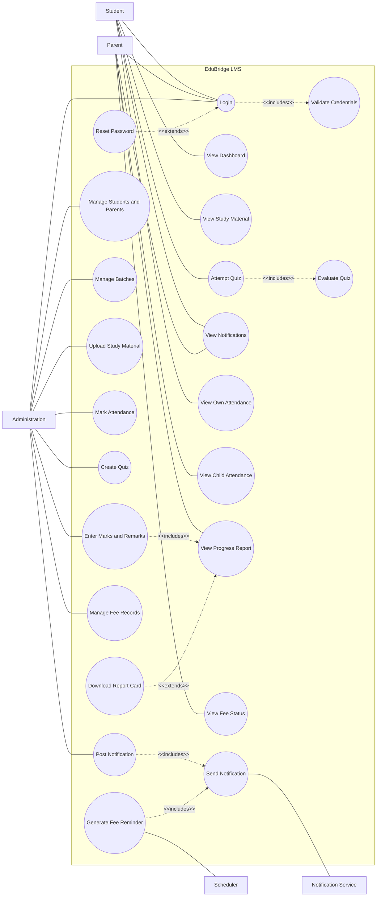
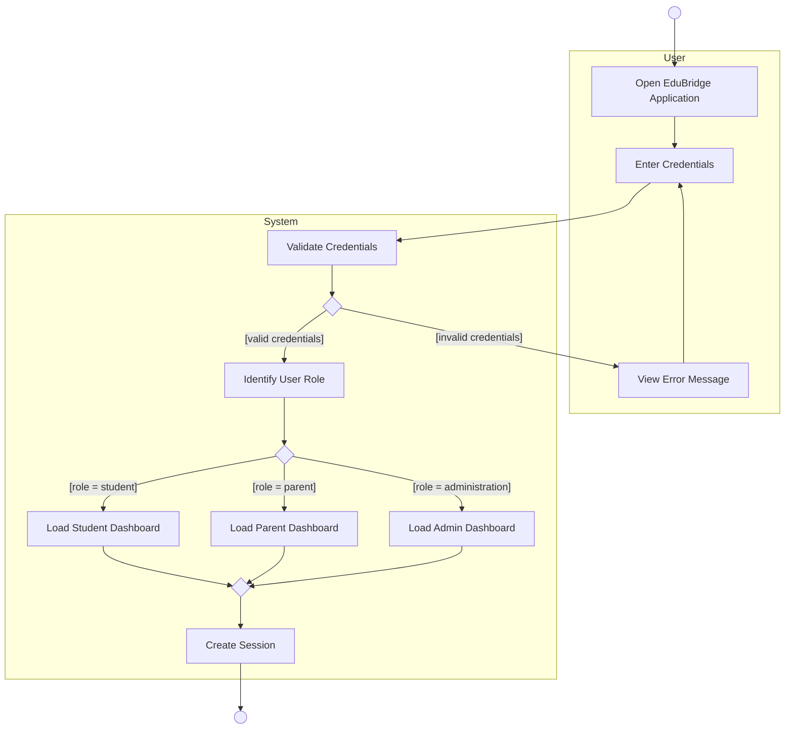
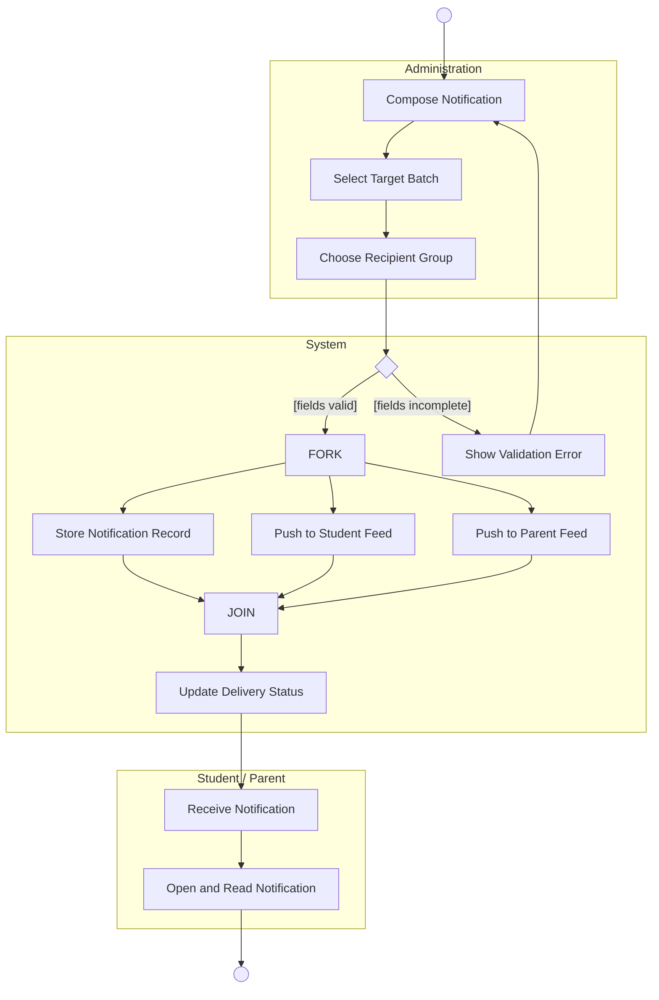

# EduBridge — UML Diagrams (Mermaid source for draw.io)

How to import:
**draw.io → Arrange → Insert → Advanced → Mermaid** → paste code → Insert.

---

## 1. Use Case Diagram

### Post-import fixes in draw.io (required)

| Element | Action |
|---|---|
| Actors (Student, Parent, Administration, Notification Service, Scheduler) | Select all 5 → right-click → **Edit Style** → replace with `shape=umlActor;verticalLabelPosition=bottom;verticalAlign=top;html=1;outlineConnect=0;` |
| Use cases | Should already be ellipses. If not: **Edit Style** → `ellipse;whiteSpace=wrap;html=1;` |
| System boundary | Select the `EduBridge LMS` container → `rounded=0;whiteSpace=wrap;html=1;verticalAlign=top;` (plain rectangle, label at top) |
| Association lines | Must have **no arrowheads**. If any appear: `endArrow=none;html=1;` |
| `<<includes>>` / `<<extends>>` | Must be **dashed with open arrowhead**: `endArrow=open;dashed=1;html=1;` |

### Relationship rationale (be ready to explain this in the viva)

- `Login <<includes>> Validate Credentials` — credential validation is common behaviour reused by every login, so it is factored into its own use case (PPT slide 17).
- `Attempt Quiz <<includes>> Evaluate Quiz` — auto-grading always runs as part of a submission.
- `Post Notification <<includes>> Send Notification` and `Generate Fee Reminder <<includes>> Send Notification` — two different use cases share the same delivery behaviour, which is the textbook reason to use `<<includes>>`.
- `Reset Password <<extends>> Login` — optional, only under the condition that the user has forgotten the password (PPT slide 18).
- `Download Report Card <<extends>> View Progress Report` — optional behaviour on top of the base use case.
- **Scheduler** and **Notification Service** are actors of the *"Other system"* category (PPT slide 14) — they are external to EduBridge but interact with it. The Scheduler is what drives automated fee reminders without the teacher initiating them.

---

## 2. Activity Diagram — Login and Role-Based Access

**Notation notes for this diagram:**
- `D1` and `D2` are **decision points** — one entry, multiple guarded exits, and the guards `[valid credentials]` / `[invalid credentials]` cover all eventualities (slide 31).
- `M1` is a **merge diamond**, not an activity with three incoming lines. This is the UML2 rule from slide 32 and is the single most common mistake in student diagrams.
- `USER` and `SYSTEM` are **swimlanes/partitions** (slide 35).

**Post-import fixes:**

| Element | Style to apply |
|---|---|
| Start node | `ellipse;fillColor=#000000;strokeColor=#000000;` (solid filled circle) |
| End node | `shape=endState;fillColor=#000000;strokeColor=#000000;` (circle inside circle) |
| Activities | `rounded=1;whiteSpace=wrap;html=1;arcSize=40;` (long rounded rectangle, slide 30) |
| Decision / merge | `rhombus;whiteSpace=wrap;html=1;` — delete the placeholder space so they are empty diamonds |
| Swimlanes | Select each `subgraph` container → `swimlane;horizontal=0;startSize=30;` |

---

## 3. Activity Diagram (Alternative) — Post Notification with Fork / Join

Use this one if you want to demonstrate **fork and join** (slide 33), which the login diagram does not contain. Instructors frequently ask for parallel behaviour, since that is the stated difference between an activity diagram and a flowchart (slide 29).

**Post-import fix for the fork and join bars:** select `FORK` and `JOIN`, delete their text, and apply
`fillColor=#000000;strokeColor=#000000;html=1;` then resize each to a wide, ~5px tall bar.

The fork means storing the record, pushing to the student feed and pushing to the parent feed all happen concurrently; the join means the delivery status cannot be updated until all three threads have completed.

---

## Checklist before submitting

- [ ] Actors are stickmen, drawn **outside** the system boundary rectangle
- [ ] Every use case is an ellipse **inside** the boundary
- [ ] Association lines have **no arrowheads**
- [ ] `<<includes>>` arrows point **towards the secondary (included)** use case
- [ ] `<<extends>>` arrows point **towards the primary (base)** use case
- [ ] Spelling is `<<includes>>` and `<<extends>>`, not `<<include>>` / `<<extend>>`
- [ ] Every decision diamond has guards on **all** outgoing edges
- [ ] Every decision is closed with a **merge diamond**, not multiple lines into one activity
- [ ] Exactly **one** start node per activity diagram
- [ ] Swimlane names are at the top of each column
